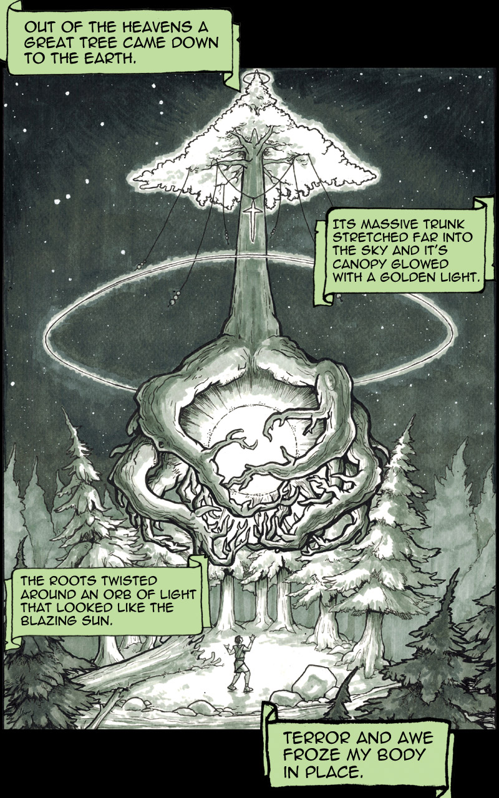
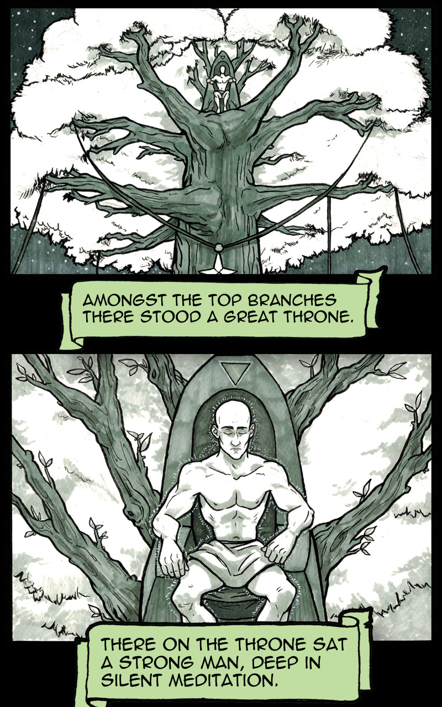
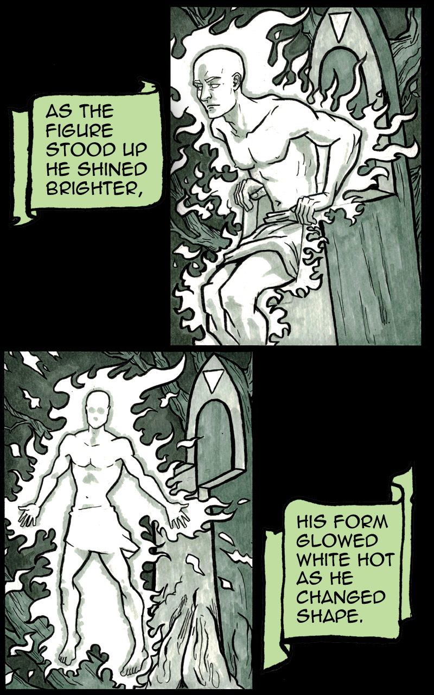
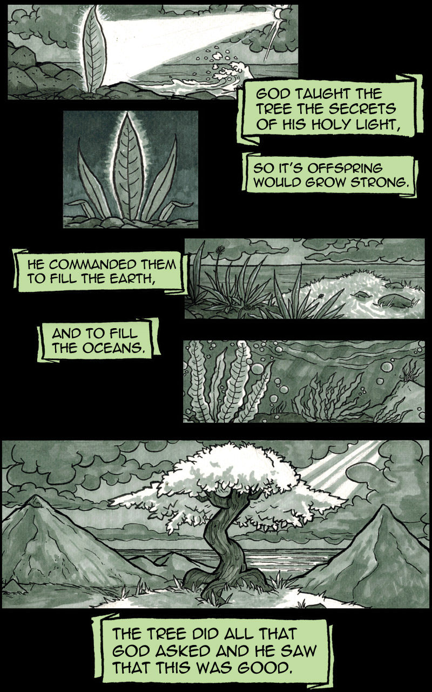
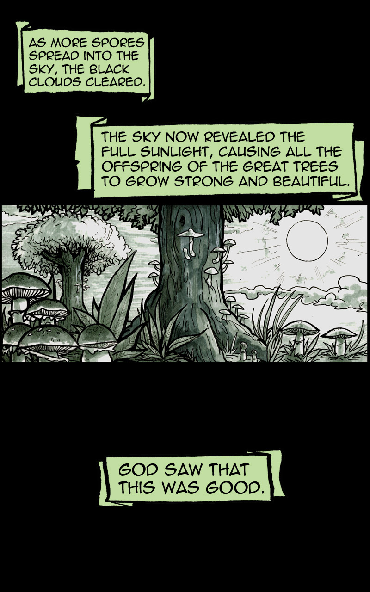
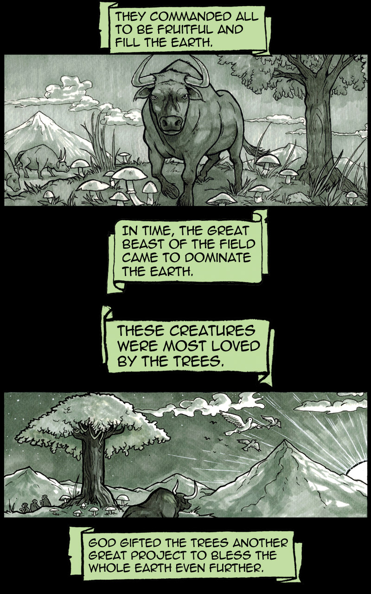

In the beginning, when the cosmos sang the Song of Death, 
Enoch walked the path between light and shadow.

  

Scroll down to read Chapter 1

  <a class="nav-menu" href="/chapter2" style="font-size: 1.2rem; font-weight: bold; color: #9fefce;">Continue to Chapter 2</a>

  <h2 style="color: #9fefce;">Leave a Comment</h2>
  <form>
    <input type="text" placeholder="Your Name" style="width: 100%; padding: 0.5rem; margin-bottom: 1rem;" />
    <textarea placeholder="Share your thoughts..." style="width: 100%; padding: 0.5rem; height: 150px;"></textarea>
     
    <button type="submit" style="margin-top: 1rem; padding: 0.5rem 1rem; background-color: #9fefce; border: none; font-weight: bold;">Post Comment</button>
  </form>

